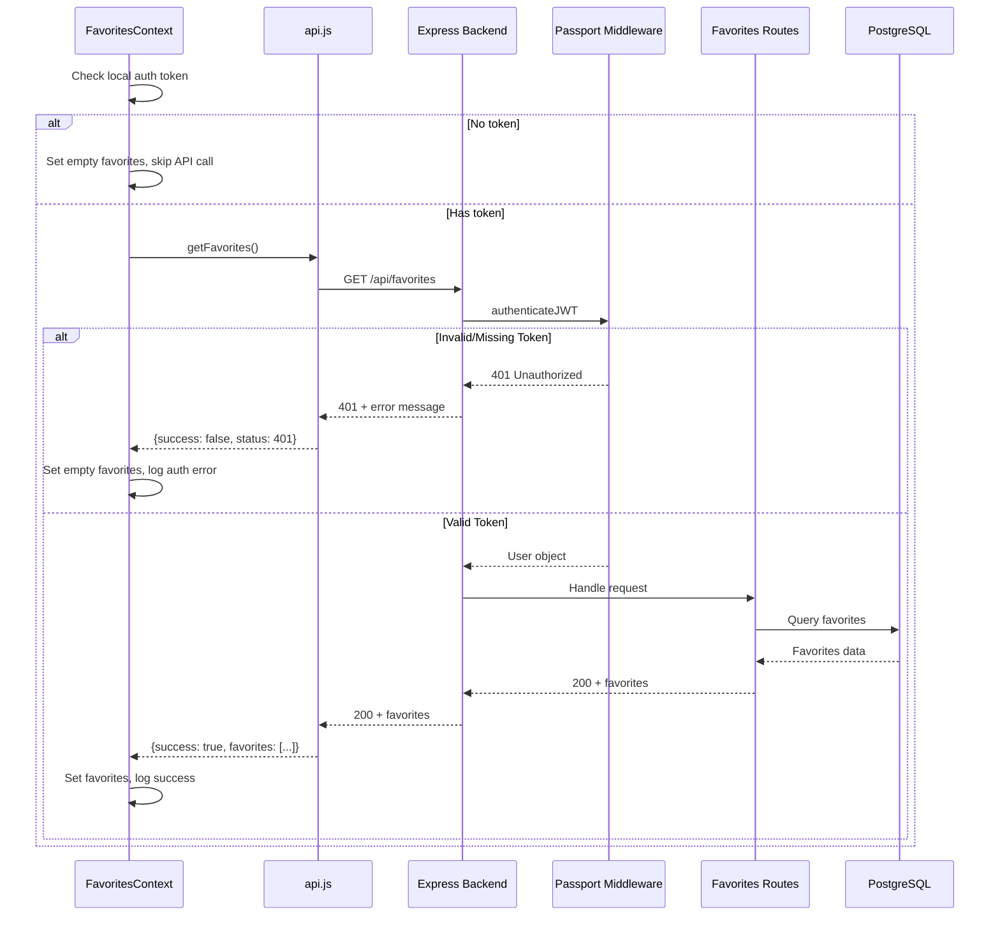

# Design Document: Favorites API 404 Fix

## Overview

This design addresses the repeated 404 Not Found errors when the React frontend fetches `/api/favorites` from the Express backend on Render. The root cause is a combination of:

1. **Authentication middleware not returning proper 401 responses** - Passport's default behavior when JWT auth fails may not return the expected 401 status
2. **Misleading console logs** - The FavoritesContext logs success messages even when API calls fail
3. **Potential re-render loops** - The useEffect dependencies and state management can cause repeated API calls

## Architecture



## Components and Interfaces

### 1. Custom JWT Authentication Middleware

Replace Passport's default `authenticate('jwt')` with a custom middleware that provides proper error responses.

```javascript
// backend/middleware/jwtAuth.js
const passport = require('passport');

const authenticateJWT = (req, res, next) => {
  passport.authenticate('jwt', { session: false }, (err, user, info) => {
    // Handle authentication errors
    if (err) {
      console.error('❌ JWT Auth Error:', err);
      return res.status(500).json({
        success: false,
        message: 'Authentication error'
      });
    }

    // No token provided
    if (!user && (!info || info.name === 'NoAuthTokenError')) {
      return res.status(401).json({
        success: false,
        message: 'No authentication token provided',
        code: 'NO_TOKEN'
      });
    }

    // Invalid or expired token
    if (!user) {
      const message = info?.message || 'Invalid authentication token';
      const isExpired = info?.name === 'TokenExpiredError';
      
      return res.status(401).json({
        success: false,
        message: isExpired ? 'Authentication token expired' : message,
        code: isExpired ? 'TOKEN_EXPIRED' : 'INVALID_TOKEN'
      });
    }

    // Success - attach user to request
    req.user = user;
    next();
  })(req, res, next);
};

module.exports = { authenticateJWT };
```

### 2. Updated FavoritesContext

Improve error handling and logging accuracy:

```javascript
// Key changes to FavoritesContext.jsx
const loadFavoritesFromDatabase = useCallback(async (force = false) => {
  // ... existing debounce logic ...

  const user = JSON.parse(localStorage.getItem('isafari_user') || '{}');
  
  if (!user.token) {
    console.log('ℹ️ [FavoritesContext] User not logged in - skipping favorites load');
    setFavorites([]);
    setIsInitialized(true);
    return;
  }

  try {
    isLoadingRef.current = true;
    lastLoadTimeRef.current = Date.now();
    setLoading(true);

    console.log('📥 [FavoritesContext] Loading favorites from database...');
    
    const response = await favoritesAPI.getFavorites();
    
    // Handle different response scenarios
    if (response.success && response.favorites) {
      console.log('✅ [FavoritesContext] Favorites loaded from database:', response.favorites.length, 'items');
      setFavorites(response.favorites);
    } else if (response.status === 401) {
      console.warn('⚠️ [FavoritesContext] User not authenticated - cannot load favorites');
      setFavorites([]);
    } else if (response.status === 404) {
      console.warn('⚠️ [FavoritesContext] Favorites endpoint not found (404)');
      setFavorites([]);
    } else {
      console.warn('⚠️ [FavoritesContext] Failed to load favorites:', response.message);
      setFavorites([]);
    }
  } catch (error) {
    console.error('❌ [FavoritesContext] Error loading favorites:', error);
    setFavorites([]);
  } finally {
    setLoading(false);
    isLoadingRef.current = false;
    setIsInitialized(true);
  }
}, []);
```

### 3. Updated API Utility

Ensure proper status code propagation:

```javascript
// Key changes to api.js apiRequest function
const apiRequest = async (endpoint, options = {}) => {
  // ... existing setup ...

  try {
    const response = await fetch(url, config);

    // Handle 401 specifically - authentication failed
    if (response.status === 401) {
      console.warn(`⚠️ [API] 401 Unauthorized: ${endpoint}`);
      const data = await response.json().catch(() => ({}));
      return {
        success: false,
        message: data.message || 'Authentication required',
        status: 401,
        code: data.code
      };
    }

    // Handle 404 specifically - endpoint not found
    if (response.status === 404) {
      console.warn(`⚠️ [API] 404 Not Found: ${endpoint}`);
      return {
        success: false,
        message: 'API endpoint not available',
        status: 404
      };
    }

    // ... rest of existing logic ...
  } catch (error) {
    // ... existing error handling ...
  }
};
```

## Data Models

No changes to data models required. The existing `favorites` table structure remains:

```sql
CREATE TABLE favorites (
  id SERIAL PRIMARY KEY,
  user_id INTEGER REFERENCES users(id),
  provider_id INTEGER REFERENCES service_providers(id),
  added_at TIMESTAMP DEFAULT CURRENT_TIMESTAMP,
  UNIQUE(user_id, provider_id)
);
```

## Correctness Properties

*A property is a characteristic or behavior that should hold true across all valid executions of a system—essentially, a formal statement about what the system should do. Properties serve as the bridge between human-readable specifications and machine-verifiable correctness guarantees.*

### Property 1: Authentication Error Response Consistency

*For any* request to `/api/favorites` with an invalid, expired, or missing JWT token, the backend SHALL return a 401 status code (never 404) with a JSON response containing `success: false` and an appropriate error message.

**Validates: Requirements 1.2, 1.4, 5.1, 5.2, 5.3, 5.4**

### Property 2: Frontend Error State Management

*For any* API response with a non-success status (401, 404, 500), the FavoritesContext SHALL set favorites to an empty array and SHALL NOT log any success messages.

**Validates: Requirements 2.1, 2.2, 2.3, 2.4**

### Property 3: API Call Deduplication

*For any* sequence of mount events or state changes in FavoritesContext, the favorites API SHALL be called at most once within any 5-second window unless explicitly forced, and concurrent calls SHALL be prevented using a loading ref.

**Validates: Requirements 3.1, 3.3, 3.4**

### Property 4: Unauthenticated User Behavior

*For any* user without a valid token in localStorage, the FavoritesContext SHALL NOT make any API calls to the favorites endpoint and SHALL immediately set favorites to an empty array.

**Validates: Requirements 3.2**

### Property 5: Successful Load State Transition

*For any* successful favorites load (API returns 200 with favorites array), the FavoritesContext SHALL set `isInitialized` to true and SHALL log the correct count of loaded favorites.

**Validates: Requirements 3.5, 4.1**

## Error Handling

### Backend Error Responses

| Scenario | Status Code | Response Body |
|----------|-------------|---------------|
| No token provided | 401 | `{success: false, message: "No authentication token provided", code: "NO_TOKEN"}` |
| Invalid token | 401 | `{success: false, message: "Invalid authentication token", code: "INVALID_TOKEN"}` |
| Expired token | 401 | `{success: false, message: "Authentication token expired", code: "TOKEN_EXPIRED"}` |
| Database error | 500 | `{success: false, message: "Error fetching favorites"}` |
| Success | 200 | `{success: true, favorites: [...], total: N}` |

### Frontend Error Handling

1. **401 Response**: Clear local auth state if token is expired, set empty favorites
2. **404 Response**: Log warning, set empty favorites (indicates backend issue)
3. **500 Response**: Log error, set empty favorites, optionally show user notification
4. **Network Error**: Log error, set empty favorites, show connection error

## Testing Strategy

### Unit Tests

1. **JWT Middleware Tests**
   - Test missing token returns 401
   - Test invalid token returns 401
   - Test expired token returns 401
   - Test valid token passes through

2. **FavoritesContext Tests**
   - Test initial state is empty array
   - Test loading state transitions
   - Test error handling for each status code
   - Test debouncing prevents rapid calls

### Property-Based Tests

Property-based testing validates universal properties across many generated inputs. Each property test should run minimum 100 iterations.

1. **Property 1 Test**: Generate random invalid tokens (malformed, expired, empty) and verify all return 401
2. **Property 2 Test**: Generate random error responses and verify state is always set to empty array
3. **Property 3 Test**: Generate rapid call sequences and verify deduplication works
4. **Property 4 Test**: Generate various localStorage states without tokens and verify no API calls
5. **Property 5 Test**: Generate successful responses and verify state transitions correctly

### Integration Tests

1. Test full flow: Login → Load favorites → Add favorite → Verify persistence
2. Test error recovery: Invalid token → Re-login → Load favorites
3. Test concurrent access: Multiple components using FavoritesContext simultaneously
