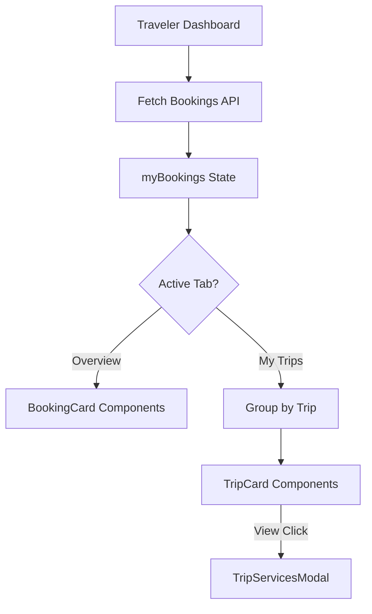

# Design Document

## Overview

Hii design inaelezea maboresho ya Traveler Portal kwenye iSafari Global, hasa sehemu ya Traveler Dashboard. Maboresho yanalenga:

1. **My Trips Tab** - Kuonyesha trips zilizopangwa vizuri kama cards tofauti, kila moja na status (Completed/Pending) na View button kuona services za trip husika
2. **Overview Tab** - Kuonyesha bookings za services moja kwa moja (flat list) badala ya trips, zilizopangwa kwa tarehe

## Architecture

### Component Structure

```
src/pages/traveler-dashboard/
├── index.jsx                    # Main dashboard (kubadilishwa)
├── components/
│   ├── TripCard.jsx            # MPYA - Card ya trip moja
│   ├── TripServicesModal.jsx   # MPYA - Modal kuonyesha services za trip
│   ├── BookingCard.jsx         # MPYA - Card ya booking moja
│   ├── UpcomingTripCard.jsx    # Existing
│   ├── PastTripGallery.jsx     # Existing
│   └── PreOrdersSection.jsx    # Existing
```

### Data Flow



## Components and Interfaces

### 1. TripCard Component

Card inayoonyesha trip moja na status yake.

```typescript
interface TripCardProps {
  trip: {
    id: string;
    name: string;
    destination: string;
    startDate: string;
    endDate: string;
    status: 'completed' | 'pending';
    services: Booking[];
    serviceCount: number;
  };
  onViewDetails: (trip: Trip) => void;
}
```

### 2. TripServicesModal Component

Modal inayoonyesha services zote za trip moja.

```typescript
interface TripServicesModalProps {
  isOpen: boolean;
  onClose: () => void;
  trip: Trip;
}
```

### 3. BookingCard Component

Card inayoonyesha booking moja ya service.

```typescript
interface BookingCardProps {
  booking: {
    id: number;
    service_title: string;
    business_name: string;
    booking_date: string;
    participants: number;
    total_price: number;
    status: 'pending' | 'confirmed' | 'completed' | 'cancelled';
  };
}
```

### 4. Utility Functions

```typescript
// Group bookings into trips
function groupBookingsIntoTrips(bookings: Booking[]): Trip[];

// Calculate trip status based on services
function calculateTripStatus(services: Booking[]): 'completed' | 'pending';

// Sort bookings by date
function sortBookingsByDate(bookings: Booking[]): Booking[];
```

## Data Models

### Trip Model (Frontend)

```typescript
interface Trip {
  id: string;
  name: string;
  destination: string;
  startDate: string;
  endDate: string;
  status: 'completed' | 'pending';
  services: Booking[];
  serviceCount: number;
}
```

### Booking Model (Existing)

```typescript
interface Booking {
  id: number;
  service_id: number;
  service_title: string;
  business_name: string;
  booking_date: string;
  participants: number;
  total_price: number;
  status: 'pending' | 'confirmed' | 'completed' | 'cancelled';
  trip_id?: string; // Optional - for grouping
}
```

## Correctness Properties

*A property is a characteristic or behavior that should hold true across all valid executions of a system-essentially, a formal statement about what the system should do. Properties serve as the bridge between human-readable specifications and machine-verifiable correctness guarantees.*

### Property 1: Trip Status Calculation

*For any* trip with a list of services, if all services have status "completed" then the trip status SHALL be "completed", otherwise the trip status SHALL be "pending".

**Validates: Requirements 2.2, 2.3**

### Property 2: Booking Grouping Consistency

*For any* list of bookings with trip_id assignments, grouping them into trips SHALL result in each booking appearing in exactly one trip, and the service count of each trip SHALL equal the number of bookings in that trip.

**Validates: Requirements 1.2, 1.3**

### Property 3: Service Details Completeness

*For any* service displayed in trip details, the rendered output SHALL contain service name, provider name, date, price, and booking status.

**Validates: Requirements 3.3**

### Property 4: Booking Card Completeness

*For any* booking displayed in Overview tab, the rendered card SHALL contain service name, provider name, booking date, participants, price, and status.

**Validates: Requirements 4.2**

### Property 5: Bookings Flat List Structure

*For any* list of bookings displayed in Overview tab, the output SHALL be a flat array (not nested/grouped) where each booking is an individual item.

**Validates: Requirements 4.3**

### Property 6: Booking Sort Order

*For any* list of bookings, after sorting, each booking's date SHALL be less than or equal to the next booking's date. For bookings with the same date, the creation time SHALL determine order.

**Validates: Requirements 5.1, 5.2**

## Error Handling

### Empty States

1. **No Trips**: Onyesha message "No trips yet" na button ya "Plan Your First Trip"
2. **No Bookings**: Onyesha message "No bookings yet" na button ya "Browse Services"
3. **Loading State**: Onyesha spinner wakati data inafetch

### API Errors

1. **Network Error**: Onyesha retry button na error message
2. **Auth Error**: Redirect to login page

## Testing Strategy

### Unit Testing

Tutatumia Vitest kwa unit tests:

1. Test `calculateTripStatus` function
2. Test `groupBookingsIntoTrips` function
3. Test `sortBookingsByDate` function
4. Test component rendering

### Property-Based Testing

Tutatumia **fast-check** library kwa property-based tests:

1. Trip status calculation property
2. Booking grouping consistency property
3. Booking sort order property

Kila property test itarun minimum 100 iterations.

### Test File Structure

```
src/pages/traveler-dashboard/
├── __tests__/
│   ├── tripUtils.test.ts       # Unit tests for utility functions
│   ├── tripUtils.property.ts   # Property-based tests
│   ├── TripCard.test.tsx       # Component tests
│   └── BookingCard.test.tsx    # Component tests
```

### Test Annotations

Kila property-based test itakuwa na comment inayoreference correctness property:

```javascript
// **Feature: traveler-portal-improvements, Property 1: Trip Status Calculation**
// **Validates: Requirements 2.2, 2.3**
```
