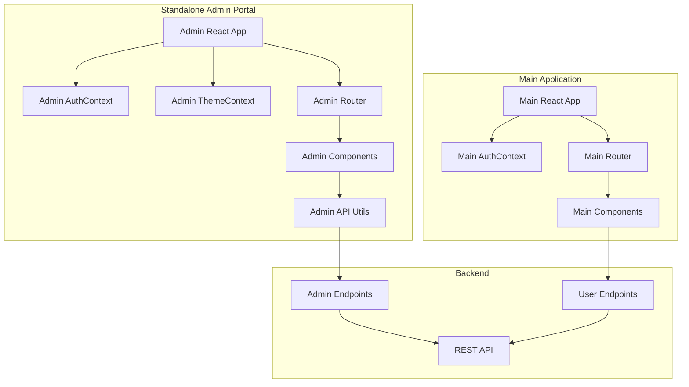

# Design Document: Admin Portal Standalone Extraction

## Overview

This design document outlines the technical approach for extracting the admin portal from the integrated main application and creating a standalone, independently deployable React application. The extraction involves:

1. Creating a new standalone React application structure in `admin-portal/`
2. Migrating all admin components and creating independent implementations of shared contexts
3. Establishing direct backend API communication
4. Setting up independent build and deployment processes
5. Cleaning up the main application by removing admin portal code

The standalone admin portal will be a complete Vite + React application with its own dependencies, routing, authentication, and styling. It will communicate exclusively with the backend API and have no runtime dependencies on the main application.

## Architecture

### High-Level Architecture



### Directory Structure

```
project-root/
├── admin-portal/                    # NEW: Standalone admin application
│   ├── public/
│   │   ├── index.html
│   │   └── assets/
│   ├── src/
│   │   ├── components/             # Admin-specific components
│   │   │   ├── DashboardOverview.jsx
│   │   │   ├── UserManagement.jsx
│   │   │   ├── ServiceManagement.jsx
│   │   │   ├── BookingManagement.jsx
│   │   │   ├── PaymentManagement.jsx
│   │   │   ├── ContentManagement.jsx
│   │   │   ├── AnalyticsReports.jsx
│   │   │   ├── SystemSettings.jsx
│   │   │   ├── SupportTickets.jsx
│   │   │   └── PromotionsMarketing.jsx
│   │   ├── contexts/               # Independent context implementations
│   │   │   ├── AuthContext.jsx
│   │   │   └── ThemeContext.jsx
│   │   ├── pages/
│   │   │   ├── AdminPortal.jsx     # Main admin portal page
│   │   │   └── Login.jsx           # Admin login page
│   │   ├── utils/
│   │   │   └── api.js              # Admin API utilities
│   │   ├── styles/
│   │   │   └── index.css           # Admin-specific styles
│   │   ├── App.jsx                 # Admin app root
│   │   └── main.jsx                # Admin app entry point
│   ├── .env                        # Admin environment config
│   ├── .env.example
│   ├── package.json                # Admin dependencies
│   ├── vite.config.js              # Admin build config
│   ├── tailwind.config.js          # Admin styling config
│   ├── postcss.config.js
│   └── README.md
├── src/                            # Main application (cleaned up)
│   ├── pages/
│   │   └── admin-portal/           # TO BE REMOVED
│   └── ...
└── ...
```

### Technology Stack

- **Framework**: React 18
- **Build Tool**: Vite
- **Styling**: Tailwind CSS
- **Routing**: React Router v6
- **State Management**: React Context API
- **HTTP Client**: Fetch API
- **Icons**: Lucide React
- **Charts**: Recharts (for analytics)

## Components and Interfaces

### 1. Admin Application Root (`admin-portal/src/App.jsx`)

**Purpose**: Root component that sets up providers and routing for the admin portal.

**Interface**:
```javascript
function App() {
  return (
    <AuthProvider>
      <ThemeProvider>
        <Router>
          <Routes>
            <Route path="/login" element={<Login />} />
            <Route path="/*" element={<ProtectedRoute><AdminPortal /></ProtectedRoute>} />
          </Routes>
        </Router>
      </ThemeProvider>
    </AuthProvider>
  );
}
```

**Responsibilities**:
- Wrap application with context providers
- Define top-level routing
- Handle protected route logic

### 2. Admin AuthContext (`admin-portal/src/contexts/AuthContext.jsx`)

**Purpose**: Manage admin authentication state and operations independently from main app.

**Interface**:
```javascript
interface AuthContextValue {
  user: AdminUser | null;
  isAuthenticated: boolean;
  isLoading: boolean;
  login: (email: string, password: string) => Promise<void>;
  logout: () => void;
  checkAuth: () => Promise<void>;
}

interface AdminUser {
  id: string;
  email: string;
  firstName: string;
  lastName: string;
  role: 'admin';
  permissions: string[];
}
```

**Key Features**:
- Store tokens in localStorage with prefix `admin_`
- Validate admin role from backend
- Auto-refresh authentication on app load
- Clear all admin data on logout

**Storage Keys**:
- `admin_token`: JWT authentication token
- `admin_user`: Serialized user object
- `admin_refresh_token`: Refresh token (if applicable)

### 3. Admin ThemeContext (`admin-portal/src/contexts/ThemeContext.jsx`)

**Purpose**: Manage theme state (light/dark mode) for admin portal.

**Interface**:
```javascript
interface ThemeContextValue {
  theme: 'light' | 'dark';
  toggleTheme: () => void;
}
```

**Storage Keys**:
- `admin_theme`: Current theme preference

### 4. Admin API Utilities (`admin-portal/src/utils/api.js`)

**Purpose**: Centralized API communication layer for admin operations.

**Interface**:
```javascript
const api = {
  // Base configuration
  baseURL: import.meta.env.VITE_API_URL || 'http://localhost:5000/api',
  
  // Authentication
  auth: {
    login: (email, password) => Promise<AuthResponse>,
    logout: () => Promise<void>,
    verifyToken: () => Promise<AdminUser>,
  },
  
  // User management
  users: {
    getAll: (filters) => Promise<User[]>,
    getById: (id) => Promise<User>,
    update: (id, data) => Promise<User>,
    delete: (id) => Promise<void>,
    toggleStatus: (id) => Promise<User>,
    verify: (id) => Promise<User>,
  },
  
  // Service management
  services: {
    getAll: (filters) => Promise<Service[]>,
    getById: (id) => Promise<Service>,
    approve: (id) => Promise<Service>,
    reject: (id, reason) => Promise<Service>,
    update: (id, data) => Promise<Service>,
    delete: (id) => Promise<void>,
  },
  
  // Booking management
  bookings: {
    getAll: (filters) => Promise<Booking[]>,
    getById: (id) => Promise<Booking>,
    updateStatus: (id, status) => Promise<Booking>,
    cancel: (id, reason) => Promise<Booking>,
  },
  
  // Payment management
  payments: {
    getAll: (filters) => Promise<Payment[]>,
    getById: (id) => Promise<Payment>,
    refund: (id, amount) => Promise<Payment>,
  },
  
  // Analytics
  analytics: {
    getDashboard: () => Promise<DashboardStats>,
    getRevenue: (startDate, endDate) => Promise<RevenueData>,
    getUserStats: () => Promise<UserStats>,
    getServiceStats: () => Promise<ServiceStats>,
  },
  
  // Content management
  content: {
    getAll: () => Promise<Content[]>,
    create: (data) => Promise<Content>,
    update: (id, data) => Promise<Content>,
    delete: (id) => Promise<void>,
  },
  
  // System settings
  settings: {
    get: () => Promise<Settings>,
    update: (data) => Promise<Settings>,
  },
  
  // Support tickets
  tickets: {
    getAll: (filters) => Promise<Ticket[]>,
    getById: (id) => Promise<Ticket>,
    respond: (id, message) => Promise<Ticket>,
    close: (id) => Promise<Ticket>,
  },
};
```

**Request Interceptor**:
- Automatically add `Authorization: Bearer <token>` header
- Handle token expiration (401 responses)
- Redirect to login on authentication failure

**Error Handling**:
- Network errors: Display user-friendly message
- 401 Unauthorized: Clear auth and redirect to login
- 403 Forbidden: Display permission denied message
- 500 Server Error: Display error with retry option

### 5. Admin Portal Main Page (`admin-portal/src/pages/AdminPortal.jsx`)

**Purpose**: Main container for admin portal with navigation and content rendering.

**Structure**:
- Top navigation bar with user info, notifications, logout
- Collapsible sidebar with menu items
- Main content area that renders active component
- State management for active tab and sidebar collapse

**Navigation Menu Items**:
1. Dashboard (DashboardOverview)
2. User Management (UserManagement)
3. Service Management (ServiceManagement)
4. Booking Management (BookingManagement)
5. Payment Management (PaymentManagement)
6. Content Management (ContentManagement)
7. Analytics & Reports (AnalyticsReports)
8. Support & Tickets (SupportTickets)
9. Promotions & Marketing (PromotionsMarketing)
10. System Settings (SystemSettings)

### 6. Admin Login Page (`admin-portal/src/pages/Login.jsx`)

**Purpose**: Authentication interface for admin users.

**Features**:
- Email and password input fields
- Form validation
- Error message display
- Loading state during authentication
- Redirect to dashboard on successful login
- Admin role verification

**Validation Rules**:
- Email: Required, valid email format
- Password: Required, minimum 6 characters

### 7. Admin Components

All 10 admin components will be migrated from `src/pages/admin-portal/components/` to `admin-portal/src/components/` with the following modifications:

**Changes Required**:
1. Update imports to use admin-specific contexts:
   - `import { useAuth } from '../contexts/AuthContext'`
   - `import { useTheme } from '../contexts/ThemeContext'`
2. Update API calls to use admin API utilities:
   - `import api from '../utils/api'`
3. Remove any imports from main application
4. Ensure all dependencies are self-contained

**Component List**:
- `DashboardOverview.jsx`: Overview statistics and charts
- `UserManagement.jsx`: User CRUD operations and status management
- `ServiceManagement.jsx`: Service approval and management
- `BookingManagement.jsx`: Booking oversight and status updates
- `PaymentManagement.jsx`: Payment tracking and refunds
- `ContentManagement.jsx`: Platform content management
- `AnalyticsReports.jsx`: Detailed analytics and reporting
- `SystemSettings.jsx`: System configuration
- `SupportTickets.jsx`: Customer support ticket management
- `PromotionsMarketing.jsx`: Marketing campaigns and promotions

### 8. Protected Route Component

**Purpose**: Ensure only authenticated admin users can access admin portal.

**Interface**:
```javascript
function ProtectedRoute({ children }) {
  const { isAuthenticated, isLoading, user } = useAuth();
  
  if (isLoading) {
    return <LoadingSpinner />;
  }
  
  if (!isAuthenticated || user?.role !== 'admin') {
    return <Navigate to="/login" replace />;
  }
  
  return children;
}
```

## Data Models

### AdminUser
```typescript
interface AdminUser {
  id: string;
  email: string;
  firstName: string;
  lastName: string;
  role: 'admin';
  permissions: string[];
  createdAt: string;
  lastLogin: string;
}
```

### AuthResponse
```typescript
interface AuthResponse {
  success: boolean;
  token: string;
  refreshToken?: string;
  user: AdminUser;
  expiresIn: number;
}
```

### DashboardStats
```typescript
interface DashboardStats {
  totalUsers: number;
  totalTravelers: number;
  totalProviders: number;
  totalServices: number;
  activeServices: number;
  pendingServices: number;
  totalBookings: number;
  pendingBookings: number;
  completedBookings: number;
  totalRevenue: number;
  monthlyRevenue: number;
  revenueGrowth: number;
  recentActivity: Activity[];
}
```

### User (for management)
```typescript
interface User {
  id: string;
  firstName: string;
  lastName: string;
  email: string;
  phone: string;
  userType: 'traveler' | 'service_provider';
  isActive: boolean;
  isVerified: boolean;
  createdAt: string;
  businessName?: string;
  totalBookings?: number;
  totalSpent?: number;
  totalServices?: number;
  rating?: number;
}
```

### Service
```typescript
interface Service {
  id: string;
  providerId: string;
  providerName: string;
  title: string;
  description: string;
  category: string;
  price: number;
  location: string;
  isActive: boolean;
  isApproved: boolean;
  createdAt: string;
  images: string[];
  rating: number;
  totalBookings: number;
}
```

### Booking
```typescript
interface Booking {
  id: string;
  userId: string;
  userName: string;
  serviceId: string;
  serviceName: string;
  providerId: string;
  providerName: string;
  status: 'pending' | 'confirmed' | 'completed' | 'cancelled';
  startDate: string;
  endDate: string;
  totalAmount: number;
  createdAt: string;
  notes?: string;
}
```

### Payment
```typescript
interface Payment {
  id: string;
  bookingId: string;
  userId: string;
  amount: number;
  currency: string;
  status: 'pending' | 'completed' | 'failed' | 'refunded';
  paymentMethod: string;
  transactionId: string;
  createdAt: string;
  refundedAmount?: number;
  refundedAt?: string;
}
```

## Build Configuration

### Vite Configuration (`admin-portal/vite.config.js`)

```javascript
import { defineConfig } from 'vite';
import react from '@vitejs/plugin-react';
import path from 'path';

export default defineConfig({
  plugins: [react()],
  resolve: {
    alias: {
      '@': path.resolve(__dirname, './src'),
    },
  },
  server: {
    port: 3001, // Different port from main app
    proxy: {
      '/api': {
        target: process.env.VITE_API_URL || 'http://localhost:5000',
        changeOrigin: true,
      },
    },
  },
  build: {
    outDir: 'dist',
    sourcemap: true,
    rollupOptions: {
      output: {
        manualChunks: {
          vendor: ['react', 'react-dom', 'react-router-dom'],
          charts: ['recharts'],
          icons: ['lucide-react'],
        },
      },
    },
  },
});
```

### Package.json (`admin-portal/package.json`)

```json
{
  "name": "isafari-admin-portal",
  "version": "1.0.0",
  "type": "module",
  "scripts": {
    "dev": "vite",
    "build": "vite build",
    "preview": "vite preview",
    "lint": "eslint src --ext js,jsx"
  },
  "dependencies": {
    "react": "^18.2.0",
    "react-dom": "^18.2.0",
    "react-router-dom": "^6.20.0",
    "lucide-react": "^0.294.0",
    "recharts": "^2.10.0"
  },
  "devDependencies": {
    "@vitejs/plugin-react": "^4.2.0",
    "vite": "^5.0.0",
    "tailwindcss": "^3.3.0",
    "postcss": "^8.4.32",
    "autoprefixer": "^10.4.16",
    "eslint": "^8.55.0",
    "eslint-plugin-react": "^7.33.2"
  }
}
```

### Tailwind Configuration (`admin-portal/tailwind.config.js`)

```javascript
export default {
  content: [
    "./index.html",
    "./src/**/*.{js,jsx}",
  ],
  theme: {
    extend: {
      colors: {
        primary: {
          DEFAULT: '#2C5F41',
          50: '#E8F5E9',
          100: '#C8E6C9',
          200: '#A5D6A7',
          300: '#81C784',
          400: '#66BB6A',
          500: '#2C5F41',
          600: '#43A047',
          700: '#388E3C',
          800: '#2E7D32',
          900: '#1B5E20',
        },
      },
    },
  },
  plugins: [],
  darkMode: 'class',
};
```

### Environment Configuration

**`.env.example`**:
```
VITE_API_URL=http://localhost:5000/api
VITE_APP_NAME=iSafari Admin Portal
VITE_APP_VERSION=1.0.0
```

**`.env`** (for local development):
```
VITE_API_URL=http://localhost:5000/api
VITE_APP_NAME=iSafari Admin Portal
VITE_APP_VERSION=1.0.0
```

**`.env.production`** (for production):
```
VITE_API_URL=https://api.isafari.com/api
VITE_APP_NAME=iSafari Admin Portal
VITE_APP_VERSION=1.0.0
```

## Migration Strategy

### Phase 1: Setup Standalone Structure
1. Create `admin-portal/` directory
2. Initialize package.json with dependencies
3. Set up Vite configuration
4. Create basic directory structure
5. Set up Tailwind CSS configuration

### Phase 2: Create Independent Contexts
1. Implement AuthContext with admin-specific logic
2. Implement ThemeContext
3. Create API utilities module
4. Test authentication flow

### Phase 3: Migrate Components
1. Copy all 10 admin components to new location
2. Update imports in each component
3. Replace context imports with admin contexts
4. Replace API calls with admin API utilities
5. Test each component individually

### Phase 4: Create Admin App Structure
1. Create App.jsx with providers and routing
2. Create main.jsx entry point
3. Create AdminPortal.jsx main page
4. Create Login.jsx page
5. Create ProtectedRoute component
6. Wire up routing

### Phase 5: Testing and Validation
1. Test authentication flow
2. Test all admin components
3. Test API communication
4. Test build process
5. Verify no dependencies on main app

### Phase 6: Main App Cleanup
1. Remove `src/pages/admin-portal/` directory
2. Remove admin routes from main app routing
3. Remove admin-only dependencies from main app
4. Test main app build
5. Verify main app functionality

## Deployment Configuration

### Netlify Configuration (`admin-portal/netlify.toml`)

```toml
[build]
  command = "npm run build"
  publish = "dist"

[[redirects]]
  from = "/*"
  to = "/index.html"
  status = 200

[build.environment]
  NODE_VERSION = "18"
```

### Vercel Configuration (`admin-portal/vercel.json`)

```json
{
  "buildCommand": "npm run build",
  "outputDirectory": "dist",
  "framework": "vite",
  "rewrites": [
    {
      "source": "/(.*)",
      "destination": "/index.html"
    }
  ]
}
```

## Error Handling

### Authentication Errors
- **401 Unauthorized**: Clear tokens, redirect to login
- **403 Forbidden**: Display "Access Denied" message
- **Invalid Credentials**: Display "Invalid email or password"
- **Network Error**: Display "Unable to connect to server"

### API Errors
- **Network Timeout**: Retry with exponential backoff
- **500 Server Error**: Display error message with retry button
- **400 Bad Request**: Display validation errors from response
- **404 Not Found**: Display "Resource not found"

### Component Errors
- Use React Error Boundaries to catch rendering errors
- Display fallback UI with error message
- Log errors to console for debugging
- Provide "Reload" button to recover

