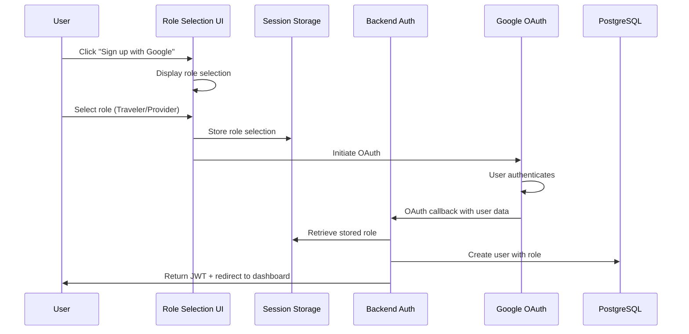
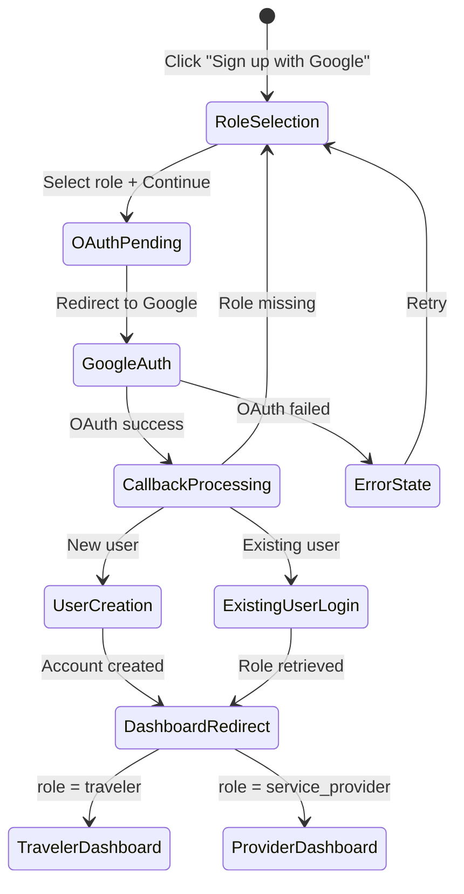

# Design Document: Google Sign-In with Role Selection

## Overview

This design implements a secure, role-based Google Sign-In authentication flow for the iSafari Global platform. The system requires users to select their role (Traveler or Service Provider) before completing Google OAuth registration, ensuring role assignment happens once and persists permanently. The architecture is designed to be extensible for future authentication providers.

## Architecture

The authentication flow follows a three-phase approach:



### Authentication Flow States



## Components and Interfaces

### Frontend Components

#### 1. GoogleRoleSelection Component
Location: `src/pages/auth/GoogleRoleSelection.jsx`

```typescript
interface GoogleRoleSelectionProps {
  onRoleSelected: (role: UserRole) => void;
  googleData?: GoogleUserData | null;
  isNewUserFlow: boolean;
}

type UserRole = 'traveler' | 'service_provider';

interface GoogleUserData {
  googleId: string;
  email: string;
  firstName: string;
  lastName: string;
  avatarUrl?: string;
}
```

#### 2. AuthContext Updates
Location: `src/contexts/AuthContext.jsx`

```typescript
interface AuthContextValue {
  user: User | null;
  isLoading: boolean;
  loginWithGoogle: () => Promise<AuthResult>;
  completeGoogleRegistration: (data: GoogleRegistrationData) => Promise<AuthResult>;
  // ... existing methods
}

interface GoogleRegistrationData {
  googleId: string;
  email: string;
  firstName: string;
  lastName: string;
  avatarUrl?: string;
  userType: UserRole;
  phone?: string;
  companyName?: string;
}
```

### Backend Components

#### 1. Auth Routes Enhancement
Location: `backend/routes/auth.js`

```typescript
// POST /api/auth/google/complete-registration
interface CompleteRegistrationRequest {
  googleId: string;
  email: string;
  firstName: string;
  lastName: string;
  avatarUrl?: string;
  userType: 'traveler' | 'service_provider';
  phone?: string;
  companyName?: string;
  businessType?: string;
  description?: string;
  serviceLocation?: string;
  serviceCategories?: string[];
  locationData?: LocationData;
}

interface CompleteRegistrationResponse {
  success: boolean;
  message: string;
  user?: UserResponse;
  token?: string;
}
```

#### 2. Passport Configuration
Location: `backend/config/passport.js`

The Google OAuth strategy handles:
- Checking for existing users by Google ID or email
- Returning `needsRegistration: true` for new users
- Returning existing user data for returning users

#### 3. Admin Routes Enhancement
Location: `backend/routes/admin.js`

```typescript
// GET /api/admin/users
interface AdminUsersQuery {
  page?: number;
  limit?: number;
  role?: 'traveler' | 'service_provider';
  authProvider?: 'google' | 'email';
  search?: string;
}

interface AdminUserResponse {
  id: number;
  name: string;
  email: string;
  phone?: string;
  role: string;
  status: string;
  authProvider: string;
  isGoogleUser: boolean;
  createdAt: string;
  lastActive?: string;
}
```

## Data Models

### User Table Schema

```sql
CREATE TABLE users (
    id SERIAL PRIMARY KEY,
    email VARCHAR(255) UNIQUE NOT NULL,
    password VARCHAR(255),  -- NULL for Google-only users
    first_name VARCHAR(100) NOT NULL,
    last_name VARCHAR(100) NOT NULL,
    phone VARCHAR(20),
    user_type VARCHAR(20) NOT NULL CHECK (user_type IN ('traveler', 'service_provider', 'admin')),
    google_id VARCHAR(255) UNIQUE,
    avatar_url TEXT,
    auth_provider VARCHAR(20) DEFAULT 'email' CHECK (auth_provider IN ('email', 'google', 'both')),
    is_verified BOOLEAN DEFAULT FALSE,
    is_active BOOLEAN DEFAULT TRUE,
    created_at TIMESTAMP DEFAULT CURRENT_TIMESTAMP,
    updated_at TIMESTAMP DEFAULT CURRENT_TIMESTAMP
);

-- Index for Google ID lookups
CREATE INDEX idx_users_google_id ON users(google_id) WHERE google_id IS NOT NULL;

-- Index for auth provider filtering
CREATE INDEX idx_users_auth_provider ON users(auth_provider);
```

### Session Storage Schema (Frontend)

```typescript
interface GoogleRegistrationSession {
  userType: 'traveler' | 'service_provider';
  phone?: string;
  companyName?: string;
  timestamp: number;  // For expiration checking
}

// Storage key: 'google_registration_data'
// Expiration: 10 minutes
```

### JWT Token Payload

```typescript
interface JWTPayload {
  id: number;
  email: string;
  userType: 'traveler' | 'service_provider' | 'admin';
  iat: number;
  exp: number;
}
```

## Correctness Properties

*A property is a characteristic or behavior that should hold true across all valid executions of a system—essentially, a formal statement about what the system should do. Properties serve as the bridge between human-readable specifications and machine-verifiable correctness guarantees.*

### Property 1: Role Selection State Management

*For any* user attempting to initiate Google OAuth, if no role has been selected, the OAuth initiation SHALL be blocked, and if a valid role is selected, it SHALL be stored in session storage before OAuth begins.

**Validates: Requirements 1.2, 1.4**

### Property 2: User Creation Data Integrity

*For any* new Google user account creation with valid input data, the resulting database record SHALL contain: the correct user_type matching the selected role, the google_id matching the Google UID, and auth_provider set to 'google'.

**Validates: Requirements 2.3, 2.4, 2.5, 6.1**

### Property 3: Existing User Login Flow

*For any* existing user signing in via Google, the system SHALL retrieve their stored role from the database and SHALL NOT display the role selection screen.

**Validates: Requirements 3.1, 3.4**

### Property 4: JWT Token Contains Role

*For any* successfully authenticated user, decoding their JWT token SHALL yield a payload containing their correct userType value matching the database record.

**Validates: Requirements 3.5**

### Property 5: Admin User List Completeness

*For any* set of users in the database, the admin users endpoint SHALL return all users with their correct roles displayed.

**Validates: Requirements 4.1**

### Property 6: Admin Google Badge Display

*For any* user with auth_provider='google' or google_id not null, the admin dashboard SHALL display a Google authentication indicator.

**Validates: Requirements 4.2**

### Property 7: Admin Filter Accuracy

*For any* filter applied to the admin users list (by role or auth provider), the returned results SHALL contain only users matching the filter criteria, and no users matching the criteria SHALL be excluded.

**Validates: Requirements 4.3, 4.4, 4.5**

### Property 8: Role Constraint Enforcement

*For any* attempt to create a user with an invalid role value (not 'traveler' or 'service_provider'), the database SHALL reject the operation with a constraint violation error.

**Validates: Requirements 5.1**

### Property 9: Role Immutability

*For any* authenticated non-admin user attempting to modify their own user_type field via API, the request SHALL be rejected and the database record SHALL remain unchanged.

**Validates: Requirements 5.2**

### Property 10: Dashboard Access Control

*For any* authenticated user attempting to access a dashboard URL not matching their role, the system SHALL redirect them to their correct dashboard based on their stored role.

**Validates: Requirements 5.3**

### Property 11: Multiple Auth Method Support

*For any* existing user with email/password authentication, linking a Google account SHALL update their auth_provider to 'both' while preserving their existing role and data.

**Validates: Requirements 6.4**

## Error Handling

### Error Categories

| Error Type | HTTP Status | User Message | Recovery Action |
|------------|-------------|--------------|-----------------|
| OAuth Failed | 302 (redirect) | "Google sign-in failed. Please try again." | Redirect to login with error param |
| Role Missing | 302 (redirect) | "Please select your account type." | Redirect to role selection |
| Duplicate Email | 400 | "An account with this email already exists." | Suggest login instead |
| Database Error | 500 | "Registration failed. Please try again." | Show retry button |
| Invalid Role | 400 | "Invalid account type selected." | Show role selection again |

### Error Logging

All errors are logged with:
- Timestamp
- Error type and message
- User identifier (if available)
- Request details (sanitized)
- Stack trace (development only)

## Testing Strategy

### Unit Tests

Unit tests focus on specific examples and edge cases:

1. **Role Selection Component**
   - Renders two role options correctly
   - Displays error when submitting without selection
   - Stores role in session storage on selection
   - Shows "Back to Login" button

2. **Auth Context**
   - Handles Google registration completion
   - Stores user data in localStorage after login
   - Clears data on logout

3. **Backend Auth Routes**
   - Validates required fields in registration
   - Rejects invalid role values
   - Handles duplicate email gracefully

### Property-Based Tests

Property-based tests verify universal properties across many generated inputs using a PBT library (fast-check for JavaScript).

Each property test will:
- Run minimum 100 iterations
- Generate random valid inputs within constraints
- Verify the property holds for all generated cases
- Tag with format: **Feature: google-signin-role-selection, Property N: [property_text]**

**Test Configuration:**
- Framework: Jest with fast-check
- Minimum iterations: 100
- Shrinking enabled for counterexample minimization

### Integration Tests

1. **Full OAuth Flow**
   - New user: role selection → OAuth → registration → dashboard redirect
   - Existing user: OAuth → login → dashboard redirect

2. **Admin Dashboard**
   - User list displays all users with correct roles
   - Filters work correctly for role and auth provider
   - Google badge appears for Google users

### Test Data Generators

```typescript
// Role generator
const roleGen = fc.constantFrom('traveler', 'service_provider');

// Google user data generator
const googleUserGen = fc.record({
  googleId: fc.string({ minLength: 10, maxLength: 30 }),
  email: fc.emailAddress(),
  firstName: fc.string({ minLength: 1, maxLength: 50 }),
  lastName: fc.string({ minLength: 1, maxLength: 50 }),
  avatarUrl: fc.option(fc.webUrl())
});

// Registration data generator
const registrationDataGen = fc.record({
  ...googleUserGen,
  userType: roleGen,
  phone: fc.option(fc.string({ minLength: 10, maxLength: 15 }))
});
```
