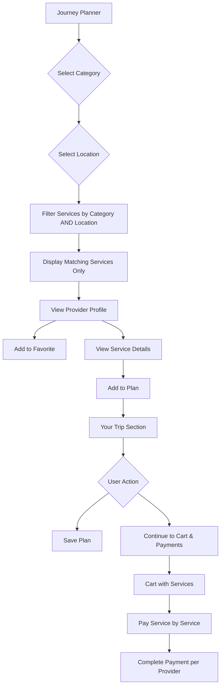

# Design Document: Journey Planner Workflow Improvements

## Overview

Hii design inaelezea mabadiliko ya kuboresha workflow ya Journey Planner na Traveler Dashboard kwenye iSafari Global platform. Mabadiliko yanalenga:

1. Kuboresha filtering ya services kwa category na location
2. Kubadilisha buttons kwenye provider cards
3. Kuongeza Favorites section kwenye dashboard
4. Kuongeza service details modal
5. Kuboresha journey plan workflow na buttons
6. Kubadilisha "Your Saved Journeys" kuwa "Your Trip"
7. Kuwezesha malipo kwa kila service tofauti
8. Kuongeza follow system kwa providers
9. Kuboresha My Trips section

## Architecture

### Component Structure

```
src/
├── pages/
│   ├── journey-planner/
│   │   └── index.jsx          # Main journey planner (updated filtering, buttons)
│   ├── traveler-dashboard/
│   │   ├── index.jsx          # Dashboard with Your Trip, Favorites tabs
│   │   └── components/
│   │       └── TripDetailsModal.jsx  # Trip details view
│   ├── provider-profile/
│   │   └── index.jsx          # Provider profile with Follow button
│   └── destination-discovery/
│       └── index.jsx          # Updated to show followed providers' services first
├── components/
│   ├── ServiceDetailsModal.jsx  # New: Service details modal
│   └── TripDetailsModal.jsx     # Updated: Complete trip details
└── contexts/
    └── CartContext.jsx          # Cart management
```

### Data Flow



## Components and Interfaces

### 1. Journey Planner Service Filtering

**File:** `src/pages/journey-planner/index.jsx`

**Changes:**
- Update `fetchServicesByCategory` to strictly filter by BOTH category AND location
- Ensure no services from other categories or locations appear

```javascript
// Strict filtering logic
const filteredServices = services.filter(service => {
  const matchesCategory = service.category === selectedCategory;
  const matchesLocation = service.location.includes(selectedLocation) || 
                          service.district === selectedDistrict ||
                          service.region === selectedRegion;
  return matchesCategory && matchesLocation;
});
```

### 2. Provider Card Buttons

**File:** `src/pages/journey-planner/index.jsx`

**Changes:**
- Remove "+select" button
- Add "View Profile" button
- Add "Add to Favorite" button

```javascript
// Provider card buttons
<Button variant="outline" onClick={() => navigate(`/provider/${provider.id}`)}>
  <Icon name="Eye" /> View Profile
</Button>
<Button variant="outline" onClick={() => addToFavorites(provider)}>
  <Icon name="Heart" /> Add to Favorite
</Button>
```

### 3. Service Details Modal

**New Component:** `src/components/ServiceDetailsModal.jsx`

**Props:**
- `service`: Service object with all details
- `isOpen`: Boolean to control modal visibility
- `onClose`: Function to close modal
- `onAddToPlan`: Function to add service to plan

**Display:**
- Service name, description, price
- Location, category
- Images gallery
- Provider info with verification status
- Accepted payment methods
- "Add to Plan" button

### 4. Favorites Section

**File:** `src/pages/traveler-dashboard/index.jsx`

**Tab:** `favorites`

**Display:**
- Grid of favorite providers
- Provider name, location, verification badge
- Follower count
- "View Profile" and "Remove" buttons

### 5. Your Trip Section

**File:** `src/pages/traveler-dashboard/index.jsx`

**Changes:**
- Rename "Your Saved Journeys" to "Your Trip"
- Display all selected services with details
- Show dates, travelers count, total cost
- "View Details" button opens TripDetailsModal
- "Continue to Payments" button for saved trips

### 6. Trip Details Modal

**File:** `src/components/TripDetailsModal.jsx`

**Display:**
- Trip destination
- Date range
- Number of travelers
- List of all services with:
  - Service name
  - Provider name
  - Price
  - Category
- Total cost
- "Continue to Payments" button

### 7. Payment Per Service

**File:** `src/pages/traveler-dashboard/index.jsx` (cart tab)

**Changes:**
- Display each service separately
- Show provider's payment methods per service
- Allow payment for one service at a time
- Update service status after payment

### 8. Provider Follow System

**File:** `src/pages/provider-profile/index.jsx`

**Changes:**
- Add "Follow" button
- Display follower count
- Toggle to "Following" when already followed
- Store followed providers in localStorage and API

**File:** `src/pages/destination-discovery/index.jsx`

**Changes:**
- Sort services to show followed providers' services first

## Data Models

### Journey Plan (localStorage)

```javascript
{
  id: number,
  country: string,
  region: string,
  district: string,
  area: string,
  startDate: string,
  endDate: string,
  travelers: number,
  services: [
    {
      id: number,
      name: string,
      title: string,
      price: number,
      category: string,
      location: string,
      provider_id: number,
      business_name: string,
      payment_methods: object
    }
  ],
  totalCost: number,
  status: 'saved' | 'pending_payment' | 'paid',
  createdAt: string
}
```

### Favorite Provider (localStorage)

```javascript
{
  id: number,
  business_name: string,
  location: string,
  is_verified: boolean,
  followers_count: number
}
```

## Correctness Properties

*A property is a characteristic or behavior that should hold true across all valid executions of a system-essentially, a formal statement about what the system should do. Properties serve as the bridge between human-readable specifications and machine-verifiable correctness guarantees.*

### Property 1: Category Filtering Consistency
*For any* service list and selected category, all displayed services SHALL have their category field exactly matching the selected category.
**Validates: Requirements 1.1, 1.4**

### Property 2: Location Filtering Consistency
*For any* service list and selected location, all displayed services SHALL have their location matching the selected location criteria.
**Validates: Requirements 1.2, 1.5**

### Property 3: Combined Filter Intersection
*For any* service list with selected category AND location, all displayed services SHALL match BOTH the category AND location criteria simultaneously.
**Validates: Requirements 1.3**

### Property 4: Favorites Round Trip
*For any* provider added to favorites, that provider SHALL appear in the favorites list when retrieved.
**Validates: Requirements 2.3, 2.4, 3.1**

### Property 5: Favorites Removal Consistency
*For any* provider removed from favorites, that provider SHALL NOT appear in the favorites list after removal.
**Validates: Requirements 3.4**

### Property 6: Service Details Completeness
*For any* service displayed in details modal, the rendered output SHALL contain service name, description, price, location, category, and provider information.
**Validates: Requirements 4.2, 4.3**

### Property 7: Save Plan Round Trip
*For any* journey plan saved via "Save Plan" button, that plan SHALL appear in "Your Trip" section with all services intact.
**Validates: Requirements 5.3, 6.2**

### Property 8: Trip Details Completeness
*For any* saved trip displayed in details view, the output SHALL contain all services with their names, dates, traveler count, and costs.
**Validates: Requirements 6.3, 6.4, 6.5**

### Property 9: Cart Total Calculation
*For any* cart with multiple services, the displayed total SHALL equal the sum of all individual service prices.
**Validates: Requirements 7.1**

### Property 10: Payment Methods Per Service
*For any* service in cart, the displayed payment methods SHALL match only that service's provider's accepted payment methods.
**Validates: Requirements 7.2, 7.4**

### Property 11: Follow Provider Round Trip
*For any* provider followed by a traveler, that provider SHALL appear in the traveler's followed list.
**Validates: Requirements 8.2**

### Property 12: Follower Count Accuracy
*For any* provider with followers, the displayed follower count SHALL reflect the actual number of travelers following that provider.
**Validates: Requirements 8.3**

### Property 13: My Trips Display Completeness
*For any* saved journey plan, the My Trips section SHALL display destination, services count, total cost, and traveler count.
**Validates: Requirements 9.1, 9.2**

## Error Handling

### Service Filtering Errors
- If no services match criteria, display helpful message with options to change category or location
- Log filtering errors for debugging

### Favorites Errors
- If localStorage is unavailable, show error message
- Handle duplicate favorites gracefully

### Payment Errors
- Display clear error messages for failed payments
- Allow retry for failed payment attempts
- Maintain cart state on payment failure

### API Errors
- Handle network errors gracefully
- Show loading states during API calls
- Provide retry options for failed requests

## Testing Strategy

### Unit Testing
- Test service filtering logic with various category/location combinations
- Test favorites add/remove operations
- Test cart total calculations
- Test trip details rendering

### Property-Based Testing

**Library:** fast-check (JavaScript property-based testing library)

**Configuration:** Minimum 100 iterations per property test

**Property Tests:**

1. **Category Filter Property Test**
   - Generate random services with various categories
   - Select random category
   - Verify all displayed services match selected category
   - **Feature: journey-planner-workflow-improvements, Property 1: Category Filtering Consistency**

2. **Location Filter Property Test**
   - Generate random services with various locations
   - Select random location
   - Verify all displayed services match selected location
   - **Feature: journey-planner-workflow-improvements, Property 2: Location Filtering Consistency**

3. **Favorites Round Trip Property Test**
   - Generate random providers
   - Add to favorites
   - Verify provider appears in favorites list
   - **Feature: journey-planner-workflow-improvements, Property 4: Favorites Round Trip**

4. **Cart Total Property Test**
   - Generate random services with prices
   - Add to cart
   - Verify total equals sum of prices
   - **Feature: journey-planner-workflow-improvements, Property 9: Cart Total Calculation**

5. **Trip Save Round Trip Property Test**
   - Generate random journey plan
   - Save plan
   - Verify plan appears in Your Trip section with all data intact
   - **Feature: journey-planner-workflow-improvements, Property 7: Save Plan Round Trip**

### Integration Testing
- Test complete workflow from service selection to payment
- Test favorites sync between components
- Test navigation between Journey Planner and Dashboard

